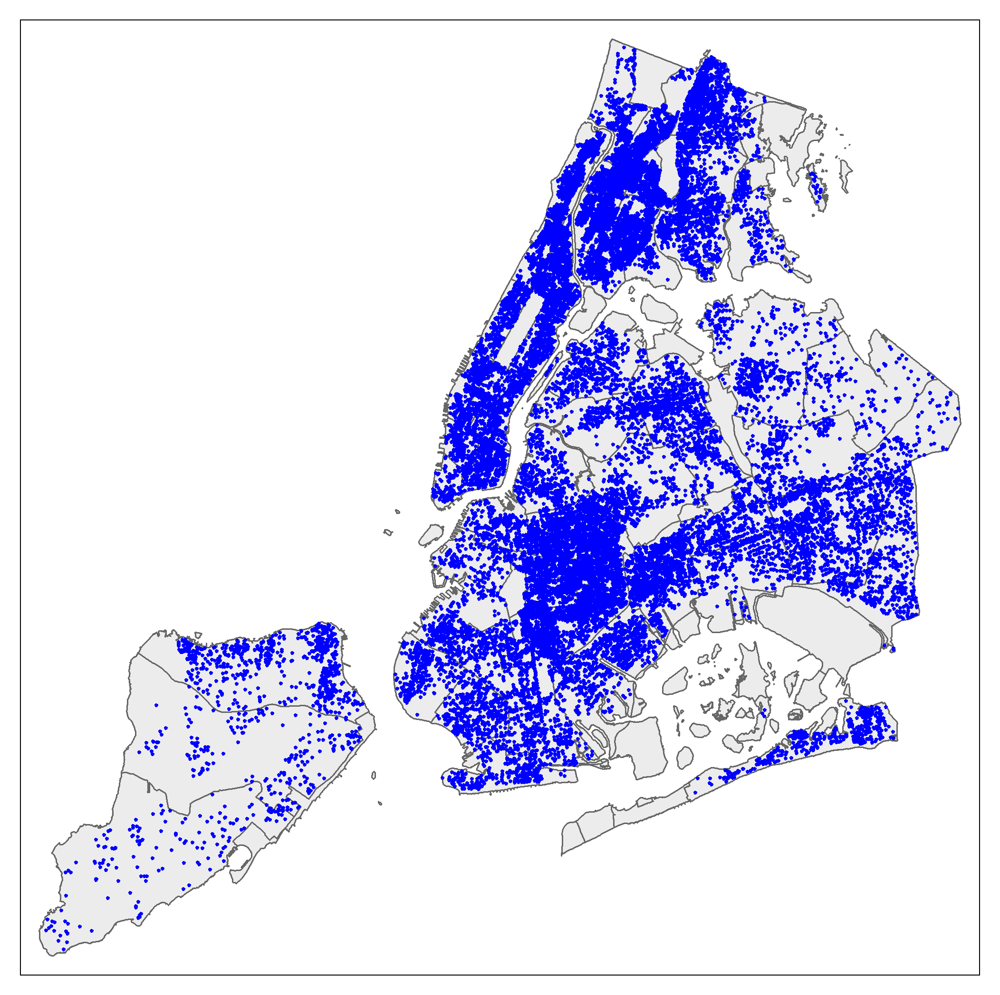
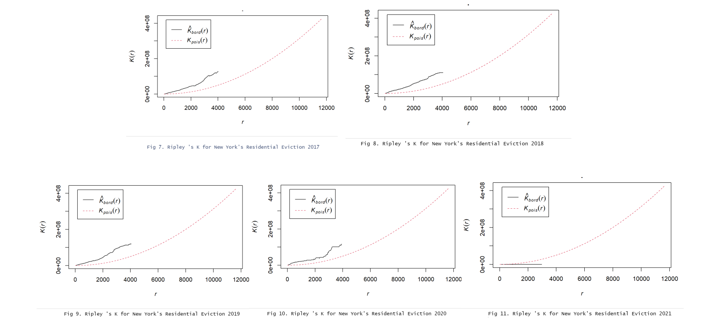
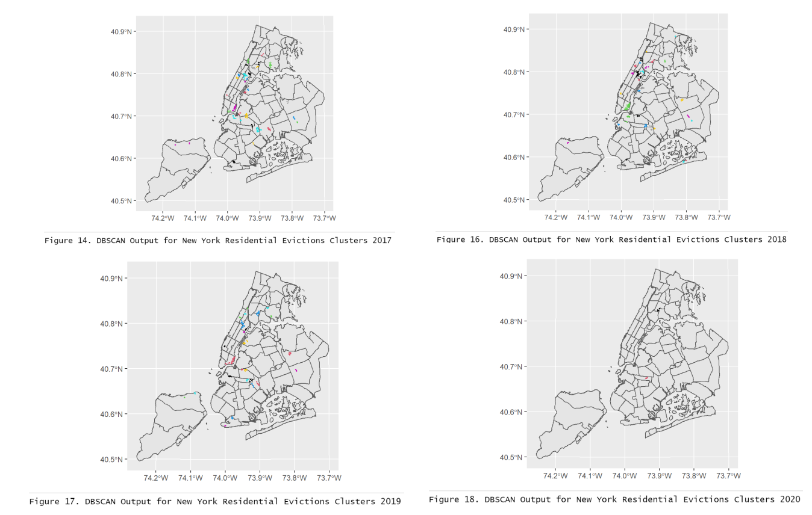

```{r setup, include=FALSE}
knitr::opts_chunk$set(echo = TRUE)
```

*Originality declaration
I, [**Baixuan Zhao**], confirm that the work presented in this assessment is my own. Where information has been derived from other sources, I confirm that this has been indicated in the work, date: ' 2022-12-14'
*Start your response here
## Initial project scope
The project aims to discover the change in spatial patterns of New York Residential Evictions from 2017 to 2021. After data pre-processing for each year's data, Ripley'K is calculated, compared with random distribution models to determine within which range of radii, the evictions are spatially randomly distributed or show clustering. Then, DBSCAN algorithm is applied to do clustering analysis on the eviction data points showing clustering. The patterns for different years are then compared. The research questions are shown as follows.
(i) Within what range of radia are the evicitions in each year from 2017 to 2021 New York spatially random or do they exhibit clustering.(Ripley's K)
(ii)What is the specific spatial distribution pattern of residential evictions showing clustering in each year for New York if there is clustering?(DBSCAN)
(iii)What is the changing trend of the spatial distribution of residential evictions over the five years from 2017 to 2021?
The question is different from the set question since it simplfies the case only uses data in for residential evictions.It is not appropriate to use 2020 as years since the data are too limited.

## Data Audit and limitation stated
  The data contains two parts. Part one is the shapefile for New York community district map, collected by the the department of city planning of city government. Since it is Google Map based, its CRS is EPSG:3857. It is useful since it provides the basic coordinate system information. Part two is the raw csv data for eviction lists.
   The raw csv data for eviction lists contains eviction cases recorded from 2017 to 2021 with corresponding court Index Number,docket number,eviction address,	eviction apartment Number,	executed date,	marshal name,residential/commercial category,	borough,	eviction postcode,	ejectment	eviction/legal possession category,	latitude, longitude, community board, council district,census tract,	BIN,	BBL,and	NTA. There NA values for latitude, longitude and cencus tract, which can affect our analysis since these missing data can not provide spatial or numerical information about the corresponding evictions.The city government collects the data and there is no obvious bias.There are no accuracy information within the data. However, the latitude and longitude are to the six dismals.Its CRS is WGS:84.The csv data needs wrangling process. First, the csv data needs to be transferred to a map-like data(sp object) in order to looking for errors due to missing values or coordinates errors. Then the csv data should be filtered based on the research question, data for 2021 and the errors detected.
The limitation of the data is that it does not contain all the cases in New York for all the time in 2021. The limitations in the analysis is that if the the clustering distribution exists but the spatial density of the data 
is not uniform, the DBSCAN algorithm may not work well. The assumption for this analysis is that the data supports the  analysis mentioned above.

## Data loading
```{r}
install.packages(tidyverse)
install.packages(sf)
install.packages(tmap)
install.packages(janitor)
library(tidyverse)

library(sf)
library(tmap)
library(janitor)

install.packages("spatstat")
library(spatstat)
install.packages(rgeos)
library(rgeos)
```
2.Read in data - added na argument in code below.
```{r}
evictions_points <- read_csv("/data/csv/Evictions.csv",na=' ')

```
```{r}
community_areas <- st_read("/data/gis/Community Districts/geo_export_cbe725d9-ad32-4682-bad7-7205998544b0.shp")
```
3. Check class - checking the variable types to make sure there are no character columns that should be numeric due to NAs
```{r}
Datatypelist <- evictions_points %>%
summarise_all(class) %>%
pivot_longer(everything(),
names_to="All_variables",
values_to="Variable_class")
Datatypelist
```
## Data wrangling
1. Check the coordinates for the csv file with the help from https://www. latlong.net/. The coordinates is WGS84. 

2. Convert csv to sf object, the map ,after filtering out the missing data of latitude and longitude. 64745 from 71618 features are left.
```{r}
points <- evictions_points%>%
filter(Longitude<0 & Latitude>0)%>%
st_as_sf (. , coords = c ("Longitude", "Latitude"),
crs = 4326)
```
3. Make a map of the evictions/legal possession data points on the community map to check if all the points are within the boundary.
```{r}
tmap_mode ("plot")
tm_shape (community_areas) +
tm_polygons(col = NA, alpha = 0.5) +
tm_shape(points) +
tm_dots(col = "blue")
```
Demonstrating the saved map
```{r}

```
      Fig. 1 Maps for New York's Eviction/Legal Possession from 2017 to 2021

4. Transform the coordinates of community_areas
```{r}
community_areas <- community_areas%>%
st_transform(., 4326)
points_sub <- points[community_areas,]
```
5. Filtering evictions points for 2017 to 2021, residential case.
String detect is used here to find the rows that 2021 within the column executed_date. It might become a problem not using it  since the dates may be in characters. The assumption is that the dates are in character format since as the dataType list shows.
example code for filtering data for 2021


```{r}
points_sub_2016<-points_sub%>%
clean_names()%>%
filter(str_detect(executed_date, "2016"))%>%

filter (eviction_legal_possession=="Eviction")%>%

filter (residential_commercial== "Residential")
```

6. Maps of spatial distribution of  New York residential evictions for 2017 to 2021
2017 
```{r}
tmap_mode ("plot")
tm_shape (community_areas) +
tm_polygons(col = NA, alpha = 0.5) +
tm_shape(points_sub_2017) +
tm_dots(col = "blue")
```
Fig. 2 Map for New York's Residential Eviction 2017 
2018
```{r}
tmap_mode ("plot")
tm_shape (community_areas) +
tm_polygons(col = NA, alpha = 0.5) +
tm_shape(points_sub_2018) +
tm_dots(col = "blue")
```
Fig. 3 Map for New York's Residential Eviction 2018
2019
```{r}
tmap_mode ("plot")
tm_shape (community_areas) +
tm_polygons(col = NA, alpha = 0.5) +
tm_shape(points_sub_2019) +
tm_dots(col = "blue")
```
Fig. 4 Map for New York's Residential Eviction 2019

2020
```{r}
tmap_mode ("plot")
tm_shape (community_areas) +
tm_polygons(col = NA, alpha = 0.5) +
tm_shape(points_sub_2020) +
tm_dots(col = "blue")
```
Fig. 5 Map for New York's Residential Eviction 2020
2021
```{r}
tmap_mode ("plot")
tm_shape (community_areas) +
tm_polygons(col = NA, alpha = 0.5) +
tm_shape(points_sub_2021) +
tm_dots(col = "blue")
```
        Fig. 6 Map for New York's Residential Eviction 2021

## Data analysis
1. Observations from the map
From the maps, it is shown that from 2017 to 2020, the residential evictions in New York show clustering characteristics with high density of evictions while it become randomly spatially distributed in 2021 with the decrease in numbers of residential evictions in New York. 
2. Point Pattern Analysis -- Ripley's K
To determine within what range of radii are the evictions are randomly distributed or clustered, Ripley's K is calculated for each year.
Use 2017 as an example:
First, files are transformed to sp object then to ppp object to fit the usage of projected coordinates.https://epsg. io/6538 is the projected coordinates used since it is in meters.

```{r}
community_areas_projected <- community_areas %>%
st_transform(., 6538)
points_sub_2017_projected <- points_sub_2017 %>%
st_transform(., 6538)
window <- as.owin(community_areas_projected)
plot (window)
```

create sp object
```{r}
points_sub_2017_projected_sp<- points_sub_2017_projected %>%
as (. , 'Spatial')
```

create ppp object
```{r}
points_sub_2017_projected_sp.ppp <- ppp (x=points_sub_2017_projected_sp@coords[, 1],
y=points_sub_2017_projected_sp@coords[, 2],
window=window)
points_sub_2017_projected_sp.ppp_unique <-   unique(points_sub_2017_projected_sp.ppp)
# unique(X) is used to drop out the duplicate points with same coordinates
```

Plot Ripley's K
```{r}
K <- points_sub_2017_projected_sp.ppp_unique%>%
Kest (. , correction='border')%>%
plot ()
```

       Fig 7. Ripley 's K for New York's Residential Eviction 2017

Conduct Similar Analysis for year 2018 to 2021
```{r}
#2018
community_areas_projected <- community_areas %>%
st_transform(., 6538)
points_sub_2018_projected <- points_sub_2018 %>%
st_transform(., 6538)
window <- as.owin(community_areas_projected)
points_sub_2018_projected_sp<- points_sub_2018_projected %>%
as (. , 'Spatial')
points_sub_2018_projected_sp.ppp <- ppp (x=points_sub_2018_projected_sp@coords[, 1],
y=points_sub_2018_projected_sp@coords[, 2],
window=window)
points_sub_2018_projected_sp.ppp_unique <- unique(points_sub_2018_projected_sp.ppp)
K <- points_sub_2018_projected_sp.ppp_unique%>%
Kest (. , correction='border')%>%
plot ()
```
     Fig 8. Ripley 's K for New York's Residential Eviction 2018
     
```{r}
#2019
community_areas_projected <- community_areas %>%
st_transform(., 6538)
points_sub_2019_projected <- points_sub_2019 %>%
st_transform(., 6538)
window <- as.owin(community_areas_projected)
points_sub_2019_projected_sp<- points_sub_2019_projected %>%
as (. , 'Spatial')
points_sub_2019_projected_sp.ppp <- ppp (x=points_sub_2019_projected_sp@coords[, 1],
y=points_sub_2019_projected_sp@coords[, 2],
window=window)
points_sub_2019_projected_sp.ppp_unique <- unique(points_sub_2019_projected_sp.ppp)
K <- points_sub_2019_projected_sp.ppp_unique%>%
Kest (. , correction='border')%>%
plot ()
```
         Fig 9. Ripley 's K for New York's Residential Eviction 2019
         
         
```{r}
#2020
community_areas_projected <- community_areas %>%
st_transform(., 6538)
points_sub_2020_projected <- points_sub_2020 %>%
st_transform(., 6538)
window <- as.owin(community_areas_projected)
points_sub_2020_projected_sp<- points_sub_2020_projected %>%
as (. , 'Spatial')
points_sub_2020_projected_sp.ppp <- ppp (x=points_sub_2020_projected_sp@coords[, 1],
y=points_sub_2020_projected_sp@coords[, 2],
window=window)
points_sub_2020_projected_sp.ppp_unique <- unique(points_sub_2020_projected_sp.ppp)
K <- points_sub_2020_projected_sp.ppp_unique%>%
Kest (. , correction='border')%>%
plot ()
```
      Fig 10. Ripley 's K for New York's Residential Eviction 2020
      
      
```{r}
#2021
community_areas_projected <- community_areas %>%
st_transform(., 6538)
points_sub_2021_projected <- points_sub_2021 %>%
st_transform(., 6538)
window <- as.owin(community_areas_projected)
points_sub_2021_projected_sp<- points_sub_2021_projected %>%
as (. , 'Spatial')
points_sub_2021_projected_sp.ppp <- ppp (x=points_sub_2021_projected_sp@coords[, 1],
y=points_sub_2021_projected_sp@coords[, 2],
window=window)
points_sub_2021_projected_sp.ppp_unique <- unique(points_sub_2021_projected_sp.ppp)
K <- points_sub_2021_projected_sp.ppp_unique%>%
Kest (. , correction='border')%>%
plot ()
```
         Fig 11. Ripley 's K for New York's Residential Eviction 2021
         

Summary of Ripley's K analysis results

```{r}

```
             Fig 12 Summary of Ripley's K s for 2017 to 2021
From the summary plots, it is shown that the spatial distribution of New York's residential evictions become more and more random since the calculated K tends to be closer to the random distribution line with the increase of time. This is probably because the signficant decrease in total number of evictions as the time goes by.

3. Point Pattern Analysis -- DBSCAN clustering analysis
Lastly, based on the results from the previous section, DBSCAN clustering analysis for New York residential Eviction in year 2017 to 2020 are conducted. The reason to choose DBSCAN algorithm is that it is density-clustering based, which corresponds to the density-based distribution of the population of certain types, evicted people in this case.
Using year 2017 as an example, to do the DBSCAN analysis, firstly,points from the spatial points data frame are extracted.
```{r}
pointstodf_2017 <- points_sub_2017_projected_sp %>%
coordinates (.) %>%
as.data.frame ()
```
Then kNN distance are calculated. The kNN distance is defined as the distance from a point to its k nearest neighbor. The kNN distance plot (distplot) displays the kNN distance of all points sorted from smallest to largest. The plot can be used to help find suitable parameter values for dbscan analsis(from Wikipedia). The dbscan analysis is run based on the KNN distance plot.

```{r}
install.packages ("dbscan")
library(dbscan)
```

Select k for k distplot. kis usually selected as 2 times dimensions -1 which is 3 (dimension = 2) MinPts = k+1 = 4
```{r}
pointstodf_2017%>%
  
  dbscan::kNNdistplot(.,k=3)
```
   Fig. 13 Kdist Plots for year 2017

eps is selected as the first threshold point's value, which is 500
```{r}
pointstodf_DBSCAN_2017 <- pointstodf_2017 %>%
  
  dbscan(., eps = 500, minPts = 4)
```

Here the selected eps and MinPts are 500 and 4 to fit the the case, which are different from the values the instructor selected as 1000 and 50.

Add the cluster information to our original dataframe
```{r}
pointstodf_2017<- pointstodf_2017 %>%
mutate(dbcluster=pointstodf_DBSCAN_2017$cluster)
```
Convert our original data frame to a sf object again
```{r}  
tosf_2017 <- pointstodf_2017%>%
  
  st_as_sf(. , coords = c ("coords.x1","coords.x2"),crs = 6538)%>%
  
  filter (dbcluster>0)
```
Map the data
```{r}
ggplot (data = community_areas_projected) +
#add the geometry of the community areas
  geom_sf() +
  
  geom_sf (data = tosf_2017, size = 0.4, colour=tosf_2017$dbcluster,fill=tosf_2017$dbcluster)  
```
Figure 14. DBSCAN Output for New York Residential Evictions Clusters 2017


DBSCAN analysis for other years from 2018 to 2020

2018
```{r}
pointstodf_2018 <- points_sub_2018_projected_sp %>%
coordinates (.) %>%
as.data.frame ()
```
```{r}
pointstodf_2018%>%
  
  dbscan::kNNdistplot(.,k=3)
```

 Fig. 15 Kdist Plots for year 2018
eps is selected as the first threshold point's value, which is 500
```{r}
pointstodf_DBSCAN_2018 <- pointstodf_2018 %>%
  
  dbscan(., eps = 500, minPts = 4)
pointstodf_2018<- pointstodf_2018 %>%
mutate(dbcluster=pointstodf_DBSCAN_2018$cluster)
tosf_2018 <- pointstodf_2018%>%
  
  st_as_sf(. , coords = c ("coords.x1","coords.x2"),crs = 6538)%>%
  
  filter (dbcluster>0)
ggplot (data = community_areas_projected) +
#add the geometry of the community areas
  geom_sf() +
  
  geom_sf (data = tosf_2018, size = 0.4, colour=tosf_2018$dbcluster,fill=tosf_2018$dbcluster)

```
Figure 16. DBSCAN Output for New York Residential Evictions Clusters 2018

2019

```{r}
pointstodf_2019 <- points_sub_2019_projected_sp %>%
coordinates (.) %>%
as.data.frame ()
pointstodf_2019%>%
  
  dbscan::kNNdistplot(.,k=3)
pointstodf_DBSCAN_2019 <- pointstodf_2019 %>%
  
  dbscan(., eps = 500, minPts = 4)
pointstodf_2019<- pointstodf_2019 %>%
mutate(dbcluster=pointstodf_DBSCAN_2019$cluster)
tosf_2019 <- pointstodf_2019%>%
  
  st_as_sf(. , coords = c ("coords.x1","coords.x2"),crs = 6538)%>%
  
  filter (dbcluster>0)
ggplot (data = community_areas_projected) +
#add the geometry of the community areas
  geom_sf() +
  
  geom_sf (data = tosf_2019, size = 0.4, colour=tosf_2019$dbcluster,fill=tosf_2019$dbcluster)

```
Figure 17. DBSCAN Output for New York Residential Evictions Clusters 2019

2020
```{r}
pointstodf_2020 <- points_sub_2020_projected_sp %>%
coordinates (.) %>%
as.data.frame ()
pointstodf_2020%>%
  
  dbscan::kNNdistplot(.,k=3)
pointstodf_DBSCAN_2020 <- pointstodf_2020 %>%
  
  dbscan(., eps = 500, minPts = 4)
pointstodf_2020<- pointstodf_2020 %>%
mutate(dbcluster=pointstodf_DBSCAN_2020$cluster)
tosf_2020 <- pointstodf_2020%>%
  
  st_as_sf(. , coords = c ("coords.x1","coords.x2"),crs = 6538)%>%
  
  filter (dbcluster>0)
ggplot (data = community_areas_projected) +
#add the geometry of the community areas
  geom_sf() +
  
  geom_sf (data = tosf_2020, size = 0.4, colour=tosf_2020$dbcluster,fill=tosf_2020$dbcluster)
```
Figure 18. DBSCAN Output for New York Residential Evictions Clusters 2020

Summary of DBSCAN Output from 2017 to 2020 for New York Residential Evictions
```{r}

```
Figure 19. DBSCAN Output for New York Residential Evictions Clusters 2017-2020

From the summary plot, it is shown that the number of the clusters of New York residential evictions decreases with time. The clusters are more concentrated on the northwestern part of New York, indicating people living in such areas may experience living problems, which should be taken care of.

## Discussion
The results shows that eviction problem become less severe for New York residential buildings. However, it reveals a pattern that previous eviction cases happens mostly on the northwestern part of the city, which means the government should take care of people's living condition there.
Further works including autocorrelation analysis to study the similarity between the eviction clusters and census density and spatial regression analysis on finding the key factors causing the cluster of the eviction like income, crime rate etc can be carried out based on the clustering analysis above.


